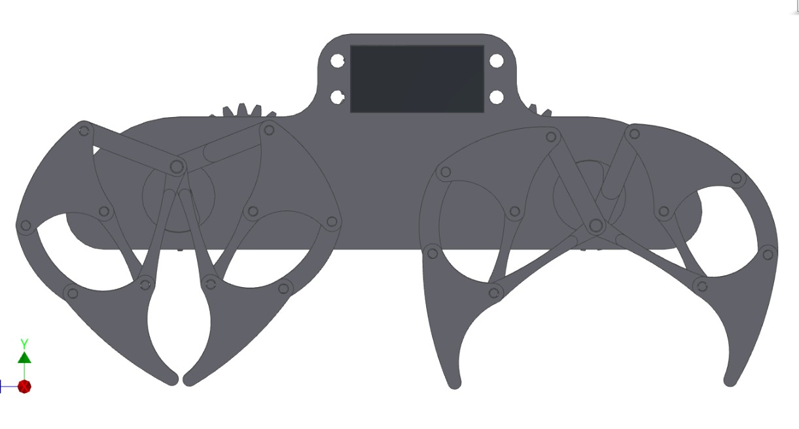

Title: 期末分組專題:AG1_仿生自走獸
Date: 2017-06-21 12:08
Category:行走機構
Tags: 行走機構
Author: AG1 

1.利用仿生獸的機構原理,利用到行走機構上,並採用3D列印將成品印製出來.

<!-- PELICAN_END_SUMMARY -->

這學期主要學習的主題是產品的設計協同，當中也學習使用程式繪製齒輪和設計連桿機構並用V-rep進行運動模擬，期末專題；仿生獸就是要運用上課所學的內容以小組做協同一起設計並做出實體

#實機成品表現

<h2>工作分配:</h2>

40423105:利用vrep模擬機構,撰寫行走程式,利用onshape協統畫圖

40423119:利用vrep模擬機構,利用onshape協統畫圖

40423128:利用vrep模擬機構,利用onshape協統畫圖

40423130:組裝,給予意見,利用onshape協統畫圖

40423133:組裝,給予意見,利用onshape協統畫圖

40423137:繪製零件圖檔,組裝,製作動畫,零件3D列印,利用onshape協統畫圖

40423144:組裝,給予意見,製作網頁,利用onshape協統畫圖

40443111:組裝,給予意見,利用onshape協統畫圖

#利用onshape共享功能將行走機構零件繪出
<h2>onshape共享設定</h2>
<iframe src="https://player.vimeo.com/video/222783342" width="800" height="600" frameborder="0" webkitallowfullscreen mozallowfullscreen allowfullscreen></iframe>

<a href="https://vimeo.com/222783342">AG1_onshape協統設定</a> from <a href="https://vimeo.com/user44512429">40423105</a> on <a href="https://vimeo.com">Vimeo</a>

上圖可看到當其他隊友正在繪製時,自己也可看到 

<a href="https://cad.onshape.com/documents/eeea69c5be9cc5faaf566c09/w/5d2ec46c1dbe432efb1792a3/e/ddbe4ad90a5eedf2ee0562db">AG1_仿生自走獸_ONSHAPE工作區連結 </a>

#onshape各組員繪圖影片
<h2>40423105</h2>

繪製本體1

繪製本體2

繪製本體3

<iframe width="800" height="600" src="https://www.youtube.com/embed/A-U-yInMy8k" frameborder="0" allowfullscreen></iframe>

<h2>40423119</h2>

繪製本體4

<iframe width="800" height="600" src="https://www.youtube.com/embed/Oya_sw9NmQs?list=PLB2pLiL12GC_VV4Vg52lCzQZTNhJrvd-H" frameborder="0" allowfullscreen></iframe>

繪製連桿1

<iframe width="800" height="600" src="https://www.youtube.com/embed/nwA6uD-xD38?list=PLB2pLiL12GC_VV4Vg52lCzQZTNhJrvd-H" frameborder="0" allowfullscreen></iframe>

繪製連桿2

<iframe width="800" height="600" src="https://www.youtube.com/embed/z1HsjEL1T2E?list=PLB2pLiL12GC_VV4Vg52lCzQZTNhJrvd-H" frameborder="0" allowfullscreen></iframe>

<h2>40423128</h2>

繪製連桿3

<iframe width="800" height="600" src="https://www.youtube.com/embed/1PQOJu9EmfU" frameborder="0" allowfullscreen></iframe>

繪製連桿4

<iframe width="800" height="600" src="https://www.youtube.com/embed/h0WH86YX26g" frameborder="0" allowfullscreen></iframe>

繪製連桿5-1

<iframe width="800" height="600" src="https://www.youtube.com/embed/X_Dhkg6WSZI" frameborder="0" allowfullscreen></iframe>

<h2>40423130</h2>

繪製連桿5-2

<iframe src="https://player.vimeo.com/video/222937200" width="800" height="600" frameborder="0" webkitallowfullscreen mozallowfullscreen allowfullscreen></iframe>

<a href="https://vimeo.com/222937200">國立虎尾科技大學_機械設計工程系_設計二甲_40423130_AG1 協同繪圖 仿生獸 連桿5-2</a> from <a href="https://vimeo.com/user61522994">40423130</a> on <a href="https://vimeo.com">Vimeo</a>.

繪製連桿6-1

<iframe src="https://player.vimeo.com/video/222937291" width="800" height="600" frameborder="0" webkitallowfullscreen mozallowfullscreen allowfullscreen></iframe>

<a href="https://vimeo.com/222937291">國立虎尾科技大學_機械設計工程系_設計二甲_40423130_AG1 協同繪圖 仿生獸 連桿6-1</a> from <a href="https://vimeo.com/user61522994">40423130</a> on <a href="https://vimeo.com">Vimeo</a>.

繪製連桿6-2

<iframe src="https://player.vimeo.com/video/222937336" width="800" height="600" frameborder="0" webkitallowfullscreen mozallowfullscreen allowfullscreen></iframe>

<a href="https://vimeo.com/222937336">國立虎尾科技大學_機械設計工程系_設計二甲_40423130_AG1 協同繪圖 仿生獸 連桿6-2</a> from <a href="https://vimeo.com/user61522994">40423130</a> on <a href="https://vimeo.com">Vimeo</a>.

<h2>40423133</h2>

繪製銷1

<iframe width="800" height="600" src="https://www.youtube.com/embed/Fy3zrIMpkk8" frameborder="0" allowfullscreen></iframe>

繪製銷2

<iframe width="800" height="600" src="https://www.youtube.com/embed/IP3QNoYsPxc" frameborder="0" allowfullscreen></iframe>

繪製銷3

<h2>40423137</h2>

<h2>40423144</h2>

<h2>40443111</h2>

#3D視圖表現
<h2>前視圖</h2>

<h2>俯視圖</h2>

<h2>右視圖</h2>

<h2>仰視圖</h2>

<h2>等角視圖</h2>

<h2>實機測試影片</h2>
<iframe width="800" height="600" src="https://www.youtube.com/embed/MdgfzWJ7YEQ" frameborder="0" allowfullscreen></iframe>

<h2>v-rep模擬製作影片</h2>
<iframe width="800" height="600" src="https://www.youtube.com/embed/SbAbBLc3E_o" frameborder="0" allowfullscreen></iframe>

由於製作四隻腳的時間過久,在製作v-rep模擬先呈現製作兩隻腳的製作過程,在下方的模擬測試中會呈現模擬四隻腳

<h2>v-rep模擬測試影片</h2>
<iframe width="800" height="600" src="https://www.youtube.com/embed/SbAbBLc3E_o" frameborder="0" allowfullscreen></iframe>

<h2>機構模擬影片</h2>

<iframe width="800" height="600" src="https://www.youtube.com/embed/12Tex9wk5eQ" frameborder="0" allowfullscreen></iframe>

<h2>成品展示</h2>

<!-- PELICAN_END_SUMMARY -->
<link href="./../work/madeleine/src/css/Madeleine.css" rel="stylesheet">

由於零件檔案過大,需等待幾秒

<h2>Arduino程式碼</h2>

<h2>AG1_仿生獸零組件下載區</h2>

<a href="./../final/fourbar/Bionic beast parts/連桿(1).stl">AG1_仿生獸零件_連桿(1)</a> (請以滑鼠右鍵存檔)

<a href="./../final/fourbar/Bionic beast parts/連桿(2).stl">AG1_仿生獸零件_連桿(2)</a> (請以滑鼠右鍵存檔)

<a href="./../final/fourbar/Bionic beast parts/連桿(3).stl">AG1_仿生獸零件_連桿(3)</a> (請以滑鼠右鍵存檔)

<a href="./../final/fourbar/Bionic beast parts/連桿(4).stl">AG1_仿生獸零件_連桿(4)</a> (請以滑鼠右鍵存檔)

<a href="./../final/fourbar/Bionic beast parts/連桿(5-1).stl">AG1_仿生獸零件_連桿(5-1)</a> (請以滑鼠右鍵存檔)

<a href="./../final/fourbar/Bionic beast parts/連桿(5-2).stl">AG1_仿生獸零件_連桿(5-2)</a> (請以滑鼠右鍵存檔)

<a href="./../final/fourbar/Bionic beast parts/連桿(6-1).stl">AG1_仿生獸零件_連桿(6-1)</a> (請以滑鼠右鍵存檔)

<a href="./../final/fourbar/Bionic beast parts/連桿(6-2).stl">AG1_仿生獸零件_連桿(6-2)</a> (請以滑鼠右鍵存檔)

<a href="./../final/fourbar/Bionic beast parts/齒輪(1).stl">AG1_仿生獸零件_齒輪(1)</a> (請以滑鼠右鍵存檔)

<a href="./../final/fourbar/Bionic beast parts/齒輪(2).stl">AG1_仿生獸零件_齒輪(2)</a> (請以滑鼠右鍵存檔)

<a href="./../final/fourbar/Bionic beast parts/正齒輪(1).stl">AG1_仿生獸零件_正齒輪(1)</a> (請以滑鼠右鍵存檔)

<a href="./../final/fourbar/Bionic beast parts/正齒輪(2).stl">AG1_仿生獸零件_正齒輪(2)</a> (請以滑鼠右鍵存檔)

<a href="./../final/fourbar/Bionic beast parts/本體(1).stl">AG1_仿生獸零件_本體(1)</a> (請以滑鼠右鍵存檔)

<a href="./../final/fourbar/Bionic beast parts/本體(2).stl">AG1_仿生獸零件_本體(2)</a> (請以滑鼠右鍵存檔)

<a href="./../final/fourbar/Bionic beast parts/本體(3).stl">AG1_仿生獸零件_本體(3)</a> (請以滑鼠右鍵存檔)

<a href="./../final/fourbar/Bionic beast parts/本體(4).stl">AG1_仿生獸零件_本體(4)</a> (請以滑鼠右鍵存檔)

<a href="./../final/fourbar/Bionic beast parts/銷(1).stl">AG1_仿生獸零件_銷(1)</a> (請以滑鼠右鍵存檔)

<a href="./../final/fourbar/Bionic beast parts/銷(2).stl">AG1_仿生獸零件_銷(2)</a> (請以滑鼠右鍵存檔)

<a href="./../final/fourbar/Bionic beast parts/銷(3).stl">AG1_仿生獸零件_銷(3)</a> (請以滑鼠右鍵存檔)

<a href="./../final/fourbar/Bionic beast parts/銷(4).stl">AG1_仿生獸零件_銷(4)</a> (請以滑鼠右鍵存檔)

<a href="./../final/fourbar/Bionic beast parts/偏心軸.stl">AG1_仿生獸零件_偏心軸</a> (請以滑鼠右鍵存檔)

<h2>AG1_仿生獸組合件下載區</h2>

<a href="./../final/fourbar/AG1仿生獸組合件.stl">AG1_仿生獸組合件</a> (請以滑鼠右鍵存檔)

<h2>AG1_仿生獸零組件尺寸圖下載區</h2>

<a href="./../final/fourbar/monkey.pdf">AG1_仿生獸零組件尺寸圖</a> (請以滑鼠右鍵存檔)

<h2>AG1_仿生獸V-rep動作模擬檔案下載區</h2>

<a href="./../final/fourbar/Bionic beast parts/AG1_仿生獸模擬運動.ttt">AG1_仿生獸V-rep動作模擬檔案</a> (請以滑鼠右鍵存檔)

